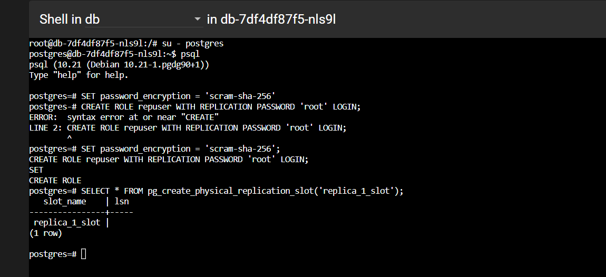

# PostgreSQL Streaming Replication
* nfs – for Primary Database
* nfs-standby – for Standby Database

## Step 1: Setup Primary Database
Change environmental variables required for Postgres

    POSTGRES_PASSWORD: "root"
    TIMESCALEDB_TELEMETRY: "off"

Apply config

    kubectl create -f db-config.yaml --save-config

## Step 2: Deploy Primary Database - nfs

    kubectl create -f nfs.yaml
    kubectl create -f db-primary.yaml --save-config

## Step 3: Nhức đầu một tí
Mục tiêu là cấu hình pod db-primary, sau đó sau chép config lưu vào k8s config.
1. Cấu hình và Tạo người

    > su - postgres
    > psql
    SET password_encryption = 'scram-sha-256';
    CREATE ROLE repuser WITH REPLICATION PASSWORD 'root' LOGIN;
    SELECT * FROM pg_create_physical_replication_slot('replica_1_slot');

<i>

* `SET password_encryption = 'scram-sha-256';`: Lệnh này đặt cài đặt mã hóa mật khẩu cho cơ sở dữ liệu thành scram-sha-256. SCRAM là một phương thức bảo mật dùng để mã hóa mật khẩu trong quá trình xác thực.

* `CREATE ROLE repuser WITH REPLICATION PASSWORD 'root' LOGIN;`: Lệnh này tạo một vai trò (role) trong PostgreSQL có tên là "repuser" với quyền đăng nhập và sử dụng để sao chép dữ liệu (replication). Mật khẩu được đặt thành "root".

* `SELECT * FROM pg_create_physical_replication_slot('replica_1_slot');`: Lệnh này tạo một khe sao chép vật lý trong PostgreSQL có tên là "replica_1_slot". Khe sao chép vật lý là một cơ chế để sao chép dữ liệu từ máy chủ nguồn (primary) sang máy chủ sao chép (replica) trong kiến trúc sao chép vật lý

</i>

2. Copy cấu hình ra khỏi Pod

       kubectl cp <namespace>/<pod_name>:/đường/dẫn/của/tệp/trong/pod /đường/dẫn/của/thư/mục/cục/bộ

       kubectl cp default/db-7df4df87f5-nls9l:/var/lib/postgresql/data/postgresql.conf ./config/postgresql.conf
       kubectl cp default/db-7df4df87f5-nls9l:/var/lib/postgresql/data/pg_hba.conf ./config/pg_hba.conf

* Thêm đoạn sao vào cuối file postgresql.conf

      #Replication Settings
      wal_level = replica
      max_wal_senders = 2
      max_replication_slots = 2
      synchronous_commit = off

* Thêm đoạn sau vào cuối file pg_hba.conf

      host    replication     repuser         0.0.0.0/0       scram-sha-256

* Apply config

      kubectl create configmap db-conf-files-config --from-file config

## Step 4: Edit file db-primary.yaml
<i>Sử dụng ConfigMap để lưu trữ cấu hình</i>

Edit content file db-primary.yaml

    kubectl create configmap db-conf-files-config --from-file config
    kubectl apply -f db-primary.yaml

## Step 5: Setup Standby Database

Tạo file db-standby.yml

    apiVersion: apps/v1
    kind: Deployment
    metadata:
    name: db-standby
    spec:
    selector:
        matchLabels:
        app: db-standby
    template:
        metadata:
        labels:
            app: db-standby
        spec:
        containers:
        - name: db-standby
            image: busybox:1.28
            imagePullPolicy: Always        
            resources:
            limits:
                memory: "128Mi"
                cpu: "500m"
        volumes:
        - name: db-standby-mnt
            persistentVolumeClaim:
            claimName: nfs-standby
        - name: db-standby-config-mnt
            configMap:
            name: db-standby-conf-files-config
        initContainers:
        - name: init-db-standby
            image: postgres:10
            command: ['sh', '-c', 'PGPASSWORD="root" pg_basebackup -h db -D /var/lib/postgresql/data -U repuser -vP ']
            volumeMounts:
            - name: db-standby-mnt
            mountPath: /var/lib/postgresql/data
            subPath: db_standby/data    
        

Tại sao lại làm cái này ư, theo hiểu là file backup, mà data không có j backup chi????\
Bỏ qua được không, hên xui thôi làm i cho chắc

    kubectl create -f db-standby.yaml

<i style="color:red">Lỗi</i>

    0/1 nodes are available: persistentvolumeclaim "nfs-standby" not found. preemption: 0/1 nodes are available: 1 No preemption victims found for incoming pod..

Tạo file nfs-standby-pvc.yaml

    kubectl apply -f nfs-standby-pvc.yaml
    kubectl create configmap db-standby-conf-files-config --from-file standby-config
    kubectl create -f db-standby.yaml
