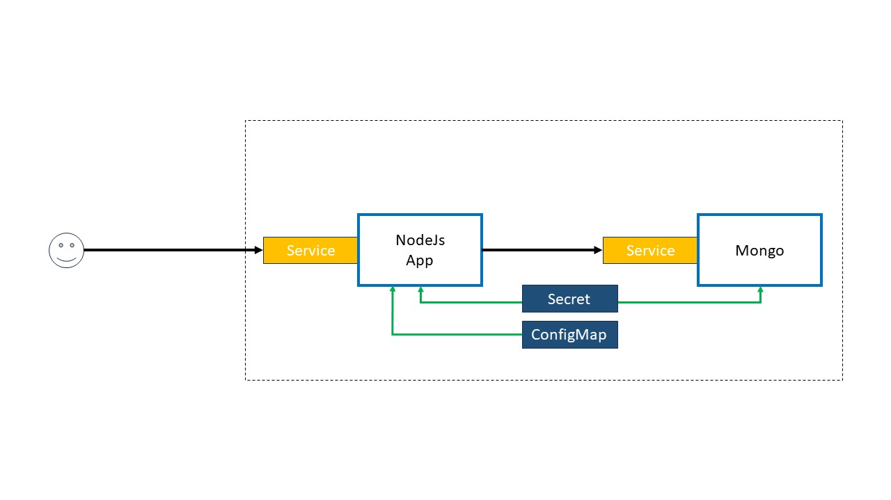

# Project build k8s
1. Using vagrant to create 2 ubuntu20.04
2. Using Ansible to install k8s
3. Start project webapp + mongo db
4. Create slave data streaming postgresql
5. Test k8s

    

6. PostgreSQL
7. Space Web app

# Golang

 