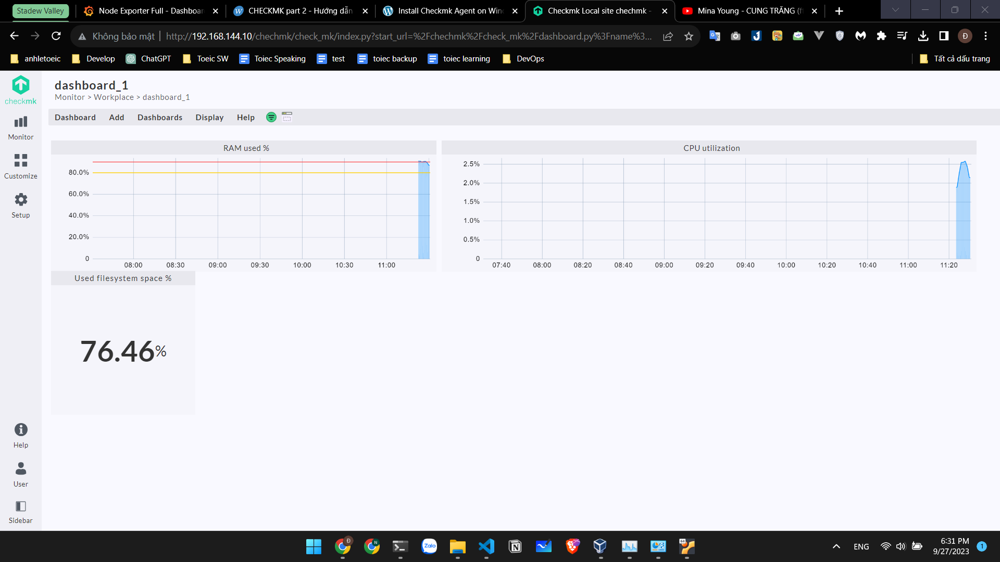

# Install checkmk

    https://www.digitalocean.com/community/tutorials/how-to-monitor-server-health-with-checkmk-on-ubuntu-20-04

    wget https://download.checkmk.com/checkmk/2.1.0p33/check-mk-free-2.1.0p33_0.focal_amd64.deb

    omd sites
    omd start

## Install checkmk agents

    http://192.168.144.10/chechmk/check_mk/index.py?start_url=%2Fchechmk%2Fcheck_mk%2Fwato.py%3Fmode%3Dagents
    curl http://192.168.144.10/chechmk/check_mk/download_agent.py?hash=2de1e708003a89e0&os=linux_deb

## Monitor windows

