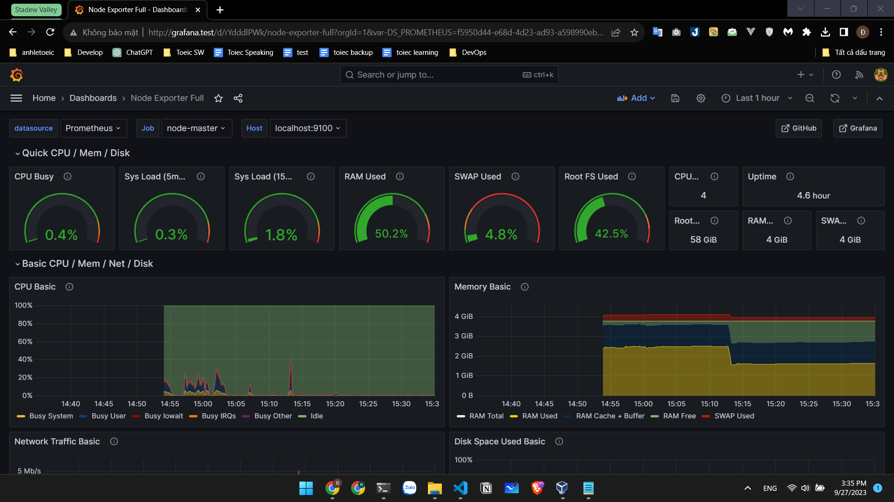

# System Monitoring
1. Infrastructure monitoring
2. Application monitoring
3. Network monitoring

## Install prometheus
    
    wget https://github.com/prometheus/prometheus/releases/download/v2.39.0/prometheus-2.39.0.linux-amd64.tar.gz
    tar -xzf prometheus-2.39.0.linux-amd64.tar.gz
    sudo mv prometheus-2.39.0.linux-amd64/prometheus /usr/local/bin/

* Install with password login
    
    https://www.digitalocean.com/community/tutorials/how-to-install-prometheus-on-ubuntu-16-04

## Install grafana
1. Download the Grafana GPG key

       wget -q -O - https://packages.grafana.com/gpg.key | sudo apt-key add -

2. add the Grafana repository to your APT sources

       sudo add-apt-repository "deb https://packages.grafana.com/oss/deb stable main"

3. Refresh your APT cache to update your package lists

       sudo apt update

4. install grafana

       sudo apt install grafana

5. start the Grafana server

       sudo systemctl start grafana-server

6. verify that Grafana is running by checking the service’s status:

       sudo systemctl status grafana-server

7. enable the service to automatically start Grafana on boot

       sudo systemctl enable grafana-server

8. [Setting Up the Reverse Proxy](./../nginx/Readme.md)

## Isntall Node Exporter in worker

    https://ourcodeworld.com/articles/read/1686/how-to-install-prometheus-node-exporter-on-ubuntu-2004

Kết quả là
